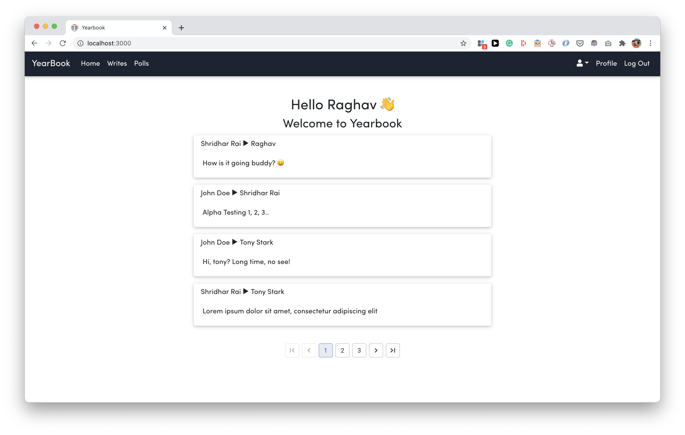
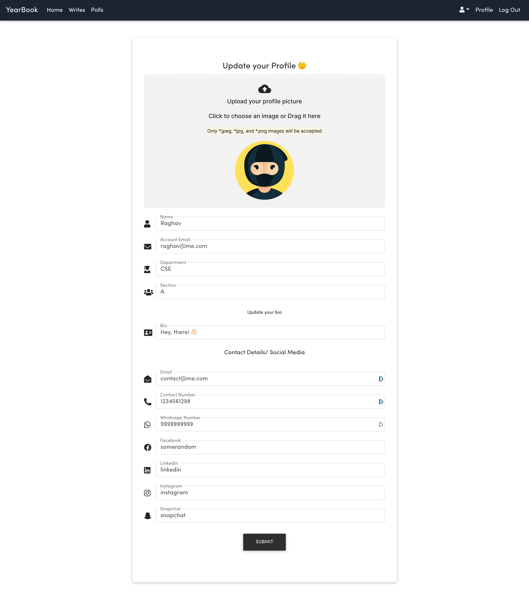

<h1 align='center'>Yearbook</h1>

  

| There are some known issues which needs to be fixed, since the project is under development phase, if you find any issue please [raise it](https://github.com/raghav4/Yearbook/issues/new/choose). The backend of the Project can be found [here](https://github.com/raghav4/yearbook-backend)

## Prerequisites

You will need the following things properly installed on your computer in order
to run this application properly.

- [Git](https://git-scm.com/)
- [Node.js](https://nodejs.org/)
- [Yarn](https://yarnpkg.com/)
- [Google Chrome](https://google.com/chrome/) or any browser.

## Installation

- Use `git clone https://github.com/raghav4/yearbook.git` for installation
- `cd yearbook`
- `yarn install` to install the dependencies
- `yarn start` to start the application

## Running

- Visit your app at [http://localhost:3000](http://localhost:3000).

## Scripts

- Use `npm run prettier` to prettify your files according to `.prettierrc`.

<!-- ## Motivation -->
<!-- The project was(is) built for the students in their final year  -->

## Features

## Screenshots

### User

### Admin

## Known Issues

- [ ] - Broken Routes/APIs
- [ ] - Stale Code

